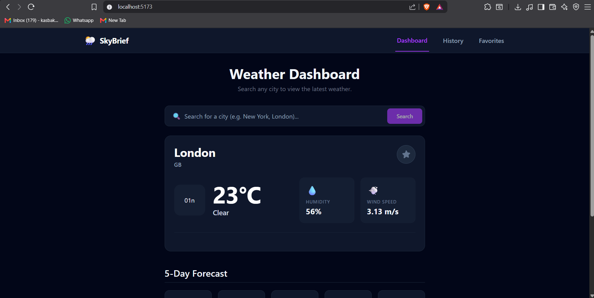
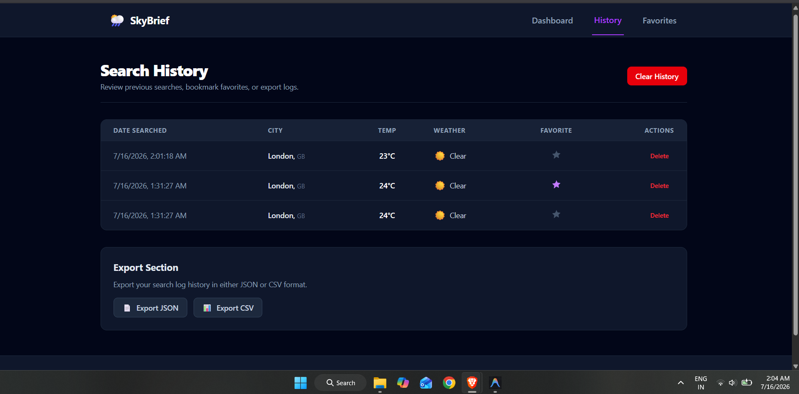

# 🌦️ Weather Dashboard (MERN Stack)

A full-stack Weather Dashboard built using the MERN Stack. The application allows users to search for weather information of any city, stores search history in MongoDB, and provides a clean and responsive user interface.

---

## 🚀 Features

- 🔍 Search weather by city
- 🌡️ View current temperature
- 💧 Humidity
- 🌬️ Wind Speed
- ☁️ Weather Condition
- ⭐ Save favourite cities
- 🕒 Search history stored in MongoDB
- 📱 Responsive UI
- ⚡ REST API built with Express.js
- 🗄️ MongoDB database integration
- 🌍 Live weather data using OpenWeather API

---

## 🛠️ Tech Stack

### Frontend
- React.js
- React Router
- Axios
- Tailwind CSS

### Backend
- Node.js
- Express.js
- MongoDB
- Mongoose
- dotenv

### External API
- OpenWeather API

---

## 📂 Project Structure

```
WeatherApp/
│
├── client/
│   ├── src/
│   ├── public/
│   └── package.json
│
├── server/
│   ├── config/
│   ├── controllers/
│   ├── models/
│   ├── routes/
│   ├── services/
│   ├── app.js
│   └── package.json
│
└── README.md
```

---

## ⚙️ Installation

### 1. Clone the repository

```bash
git clone https://github.com/yourusername/weather-dashboard.git
```

---

### 2. Install Backend Dependencies

```bash
cd server
npm install
```

---

### 3. Install Frontend Dependencies

```bash
cd ../client
npm install
```

---

## 🔑 Environment Variables

Create a `.env` file inside the **server** folder.

```env
PORT=5000

MONGO_URI=Your_MongoDB_Connection_String

OPENWEATHER_API_KEY=Your_OpenWeather_API_Key
```

---

## ▶️ Running the Project

### Backend

```bash
cd server
npm run dev
```

Backend runs on

```
http://localhost:5000
```

---

### Frontend

```bash
cd client
npm run dev
```

Frontend runs on

```
http://localhost:5173
```

---


## 📷 Screenshots

### Dashboard


### Favorites


### History


---

## 🎥 Demo Video

Watch the project demo here:

👉 [Weather Dashboard Demo](https://youtu.be/XCY0Ed40r9g)

---

## 📌 Future Improvements

- User Authentication
- Geolocation Support
- Weather Charts
- Deployment using Render & Vercel

---

## 👨‍💻 Author

**Ajeet Mishra**

Built as a MERN Stack practice project.

---

## 📄 License

This project is for educational purposes.
